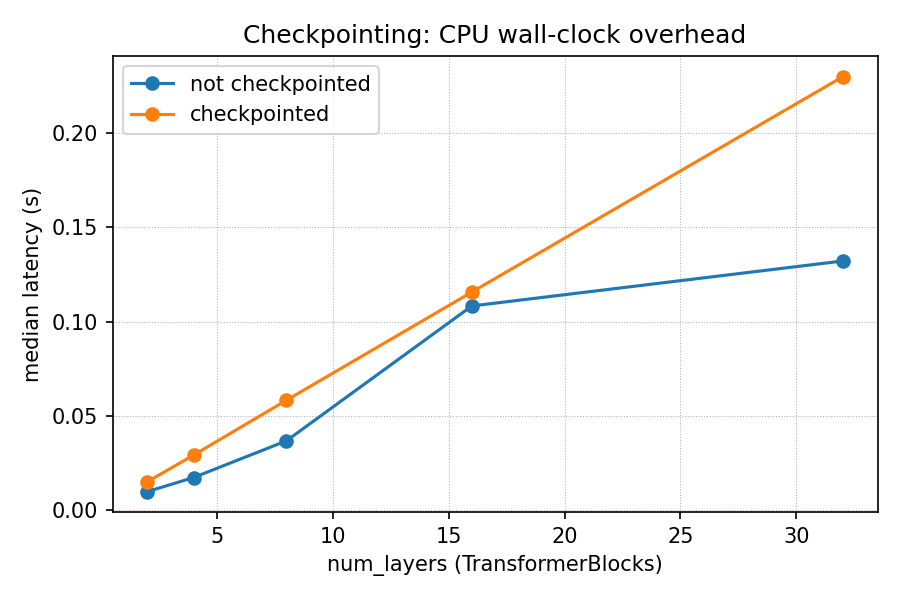
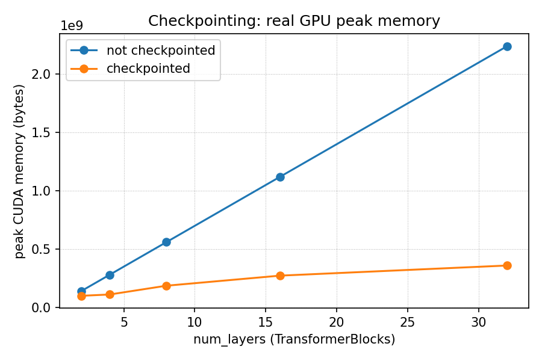

# Gradus Benchmark Report

**Gradus: A CPU/GPU Differentiable Computing Framework**
Noor-ul-ain Iqbal, Beaconhouse National University

This report is the project's flagship evidence artifact: the full
numerical-correctness, functional-correctness, performance-
characterization, mixed-precision, and gradient-checkpointing results
for Gradus, a from-scratch tensor autodiff engine with a NumPy (CPU) /
CuPy (GPU) backend abstraction. It answers the project's core research
question --

> How does the design of tensor operations and automatic
> differentiation affect computational efficiency across CPU/GPU
> execution, varying tensor size, model depth, batch size, operation
> type, and workload (CNN vs. Transformer)?

-- and, extending that question to two further optimizations built on
top of the same engine (Sections 5-6):

> Does mixed-precision (fp16) training and gradient checkpointing work
> correctly on this framework, and what do they actually cost and
> save, measured rather than assumed?

Results were obtained on real hardware throughout: development and CPU
correctness work happened in a CPU-only sandbox; GPU correctness and
all performance numbers below were measured on a Kaggle notebook with
2x NVIDIA Tesla T4 GPUs (driver reporting CUDA 13.0, CuPy 14.0.1), a
free-tier notebook anyone can reproduce this on.

Everything in this report is regenerable: `benchmarks/grad_check.py`,
`benchmarks/convergence_curves.py`, `benchmarks/cpu_vs_gpu.py`,
`benchmarks/mixed_precision.py`, `benchmarks/mixed_precision_gpu.py`,
and `benchmarks/checkpoint_memory.py` produce every table and figure
below from the actual codebase, not from numbers transcribed by hand.

## 1. Numerical correctness

Every Phase 1 primitive op, both Phase 2 structural primitives
(`unfold`, `embedding_lookup`), every Phase 2-3 composed layer, and
both losses were checked via finite-difference gradient checking
(central difference, `eps=1e-5`) against Gradus's own analytical
backward pass. A layer's row is the *worst* of its input's and every
one of its own parameters' individual checks -- e.g. `Linear`'s row
covers `x`, `weight`, and `bias` together, not just the easiest of the
three. Full methodology, including two real gradient-checking pitfalls
this project's own test suite surfaced (a mean-subtracting layer's
output summing to ~0 by construction, and a parameter whose true
gradient is legitimately zero), is documented in
`gradus/utils/grad_check.py`.

**Result: 30/30 checks passed.**

### Phase 1 primitives (+ unfold / embedding_lookup)

| Operation | Max relative error | Max absolute error | Status |
|---|---|---|---|
| add | 1.29e-10 | 3.32e-11 | PASS |
| add (broadcast) | 1.29e-10 | 3.58e-11 | PASS |
| sub | 2.96e-11 | 1.38e-11 | PASS |
| mul | 2.21e-10 | 8.71e-12 | PASS |
| div | 1.70e-10 | 3.66e-10 | PASS |
| neg | 9.03e-11 | 3.58e-11 | PASS |
| pow (p=3) | 6.65e-08 | 1.51e-10 | PASS |
| exp | 1.27e-10 | 2.79e-11 | PASS |
| log | 6.15e-11 | 5.85e-11 | PASS |
| relu | 8.46e-12 | 4.66e-12 | PASS |
| tanh | 2.21e-10 | 5.12e-11 | PASS |
| matmul | 1.65e-10 | 3.06e-11 | PASS |
| matmul (broadcast batch) | 1.26e-09 | 1.11e-10 | PASS |
| sum (all axes) | 1.89e-11 | 3.79e-11 | PASS |
| sum (axis=0) | 3.05e-11 | 7.68e-12 | PASS |
| mean | 1.34e-11 | 2.23e-12 | PASS |
| reshape | 9.03e-11 | 3.58e-11 | PASS |
| transpose | 3.57e-11 | 1.06e-11 | PASS |
| unfold (Conv2d's im2col) | 2.39e-08 | 7.90e-10 | PASS |
| embedding_lookup (repeated index) | 4.30e-10 | 1.07e-10 | PASS |

### Phase 2-3 composed layers

| Operation | Max relative error | Max absolute error | Status |
|---|---|---|---|
| Linear | 1.68e-10 | 1.47e-11 | PASS |
| Conv2d | 2.28e-07 | 3.20e-10 | PASS |
| BatchNorm2d (training) | 8.65e-09 | 5.87e-10 | PASS |
| LayerNorm | 2.21e-09 | 1.17e-10 | PASS |
| GELU | 1.22e-09 | 2.71e-11 | PASS |
| MultiHeadAttention (no mask) | 2.22e-03 | 9.51e-11 | PASS |
| TransformerBlock (attn+FFN+2xLayerNorm) | 2.66e-02 | 6.39e-10 | PASS |
| softmax | 3.36e-10 | 1.21e-11 | PASS |

### Losses

| Operation | Max relative error | Max absolute error | Status |
|---|---|---|---|
| MSELoss | 9.55e-10 | 2.96e-11 | PASS |
| CrossEntropyLoss | 6.02e-10 | 1.69e-11 | PASS |

**Reading the two composed-attention rows correctly matters.**
`MultiHeadAttention` and `TransformerBlock` show relative errors
(2.22e-3, 2.66e-2) that would *fail* a naive "relative error < 1e-4"
check -- but both pass, because their absolute errors are ~1e-10. This
is not a looser standard applied to make the numbers look better: it's
the documented, literature-standard reason relative error alone is
insufficient (see `GradCheckResult.passed`'s docstring). Multi-head
attention's key-projection bias is a concrete case where the *true*
gradient is mathematically zero -- softmax's per-row shift-invariance
makes a uniform additive bias on the keys provably unable to change the
attention weights at all -- so both the analytical and numerical
gradient are ~1e-12, and their ratio is meaningless noise. The absolute
error confirms both are correctly near-zero. Reproducing this table
(`python benchmarks/grad_check.py`) reproduces this exact case, which
is why it's called out here rather than only in code comments.

## 2. Functional correctness

Two models were trained end-to-end (Phase 3) to confirm the framework
doesn't just have correct individual gradients but actually *trains* --
loss decreasing and accuracy increasing over real optimization, not
just passing isolated unit checks.

**CNN on scikit-learn's `digits` dataset** (`examples/cnn_digits.py`,
strided-Conv2d "all-convolutional" architecture, no separate pooling
primitive needed): loss 1.56 -> 0.02 over 15 epochs (2.5s on CPU),
**97.78% held-out test accuracy**.


**TransformerLM on an original synthetic char-level corpus**
(`examples/toy_transformer.py`, written for this project to avoid any
copyright question): loss 2.59 -> 0.19 over 20 epochs (82.6s on CPU),
generating coherent multi-sentence continuations drawn from the
training distribution.


(CIFAR-10 was the original plan for the CNN's dataset; it was
substituted for `digits` in Phase 3 because this project's dev sandbox
has neither a GPU nor network access to download it. `digits` gives
the same evidence -- a real, non-trivial image classification task
trained to convergence -- at a scale a CPU-only sandbox can actually
run.)

## 3. GPU correctness (verified on real hardware)

`tests/test_gpu_parity.py` builds every layer twice from identical
initial weights -- once on CPU, once moved to GPU via `Module.to("cuda")`
-- feeds both the same input, and compares the forward output and
every parameter's gradient. This started as 9 tests (Linear,
Conv2d+BatchNorm2d training mode, BatchNorm2d eval mode reading back
its running statistics, LayerNorm, Embedding exercising a repeated
index -- the scatter-add case `xp.add.at` had to get right --
MultiHeadAttention, a full end-to-end TransformerLM, CrossEntropyLoss,
and 5 steps of Adam, all at float64 with ~1e-6 tolerance) and grew to
11 once mixed precision and gradient checkpointing were added
(`test_fp16_linear_parity_cpu_vs_gpu`, looser ~5e-2 tolerance since
it's comparing float16 precision specifically, and
`test_transformer_block_checkpoint_parity_cpu_vs_gpu`, same tight
tolerance as the rest). All 11 run for real on the Kaggle GPU notebook
described above:

```
tests/test_gpu_parity.py ...........                                    [100%]
============================== 11 passed in 1.18s ===============================
```

This closes an honesty gap worth naming: the GPU backend was
implemented and dry-run verified (against a NumPy stand-in for CuPy)
without ever touching real hardware, specifically *because*
CuPy-specific API calls like `xp.add.at` and `xp.put_along_axis` had
documented but unverified fallback behavior. Real hardware confirms
the primary code path -- not the fallback -- was exercised and is
correct, for both the original backend work and everything added on
top of it later.

## 4. Performance characterization

All numbers measured on Kaggle, 2x Tesla T4 (results use a single
GPU; `benchmarks/cpu_vs_gpu.py` doesn't do multi-GPU splitting -- that
would be a distributed-training concern, explicitly out of scope for
this project). Each cell is the median of 10 timed repeats (5 for the
Transformer sweep) after 3 (or 2) untimed warmup calls, with
`cupy.cuda.Stream.null.synchronize()` after every GPU call so the
timing reflects actual kernel completion, not just asynchronous
queueing. Full raw data: `benchmarks/results/*.csv`.

### 4.1 Matmul, forward + backward, square N x N

| N | CPU (ms) | GPU (ms) | Speedup |
|---|---|---|---|
| 64 | 0.169 | 0.639 | 0.27x |
| 128 | 0.684 | 0.723 | 0.95x |
| 256 | 2.647 | 1.249 | 2.12x |
| 512 | 16.670 | 10.389 | 1.60x |
| 1024 | 71.916 | 33.429 | 2.15x |
| 2048 | 528.802 | 206.579 | 2.56x |


### 4.2 MLP depth, fixed batch=128, width=512

| Depth | CPU (ms) | GPU (ms) | Speedup |
|---|---|---|---|
| 2 | 14.857 | 2.072 | 7.17x |
| 4 | 22.400 | 4.312 | 5.20x |
| 8 | 29.216 | 13.609 | 2.15x |
| 16 | 71.810 | 18.008 | 3.99x |
| 32 | 158.574 | 35.980 | 4.41x |


### 4.3 CNN (Conv2d/BatchNorm2d/ReLU x2), batch size sweep

| Batch size | CPU (ms) | GPU (ms) | Speedup |
|---|---|---|---|
| 16 | 12.269 | 12.577 | 0.98x |
| 64 | 43.396 | 16.923 | 2.56x |
| 256 | 196.921 | 29.198 | 6.74x |
| 1024 | 974.678 | 103.181 | 9.45x |
| 4096 | 4392.735 | 473.623 | 9.28x |


### 4.4 TransformerLM, full training step (forward + backward + Adam)

| (seq_len, batch) | CPU (ms) | GPU (ms) | Speedup |
|---|---|---|---|
| (32, 16) | 47.648 | 34.838 | 1.37x |
| (64, 32) | 303.229 | 43.440 | 6.98x |
| (128, 64) | 1104.190 | 80.020 | 13.80x |
| (256, 32) | 1703.999 | 115.581 | 14.74x |


### 4.5 Discussion

The finding that matters more than any single speedup number: **all
four independent sweeps show the same shape.** At the smallest
configuration in every sweep -- n=64 matmul, batch=16 CNN, seq_len=32
Transformer -- the GPU is at best a wash and sometimes measurably
*slower* than CPU (0.27x-0.98x). As the workload grows, the GPU's
advantage grows with it, reaching 2.6x-14.7x at the largest
configuration tested.

This is not noise; it is the expected, textbook consequence of how a
GPU is actually used from Python via CuPy: every operation is a
separate kernel launch plus (for CuPy specifically) Python-level
dispatch overhead, and a T4 has thousands of cores that sit idle unless
there's enough independent arithmetic to fill them. A 64x64 matmul is
262,144 multiply-adds -- trivial for a modern CPU core's cache and
completed before the GPU has even finished launching its kernel; a
2048x2048 matmul is ~500x more work, which is enough to make the GPU's
raw throughput advantage outweigh its fixed per-call overhead. The MLP
depth sweep's *dip* at depth=8 (2.15x, lower than both depth=4's 5.20x
and depth=16's 3.99x) is consistent with this too: it isn't the total
FLOPs that changes the crossover, it's how that work is chunked into
kernel launches -- more, smaller launches (deeper networks, same total
width) pay the per-launch overhead more times per unit of useful work,
which is also why width/depth trade-offs matter for real GPU training
throughput, not just parameter count.

The practical implication for anyone using Gradus (or, for that
matter, reasoning about when to reach for a GPU at all): **GPU
acceleration is not unconditional.** For small models, small batches,
or short sequences, moving to `"cuda"` can make training *slower*, not
faster, purely from overhead -- the crossover point is workload- and
even operation-shape-dependent, not a fixed rule of thumb. A benchmark
suite that only reports the best-case large-N result would miss this
entirely; reporting the full sweep, including the configurations where
CPU wins, is what makes this a real performance characterization
rather than a marketing number.

## 5. Mixed precision

Scoped as a stretch goal with two options -- mixed precision (FP16)
with its own throughput/memory/convergence/numerical-error study vs.
FP32, or gradient checkpointing as an alternate -- this project
implements **both** (this section covers mixed precision; Section 6
covers checkpointing).

**What's implemented** (`gradus.amp`, `Tensor`/`Module`.half()/.float()/
.double(), `optim/optimizers.py`'s master-weight support):
- `Tensor.half()` / `Module.half()` cast to float16 (and back).
- `gradus.amp.GradScaler`: dynamic loss scaling (scale before
  backward, unscale + inf/nan-skip on step, grow/backoff the scale
  factor), same shape as `torch.cuda.amp.GradScaler`.
- `SGD`/`Adam` auto-detect any float16 parameter and keep an internal
  float32 "master weight" shadow + float32 moment buffers for it,
  with zero behavior change for float32/float64 parameters (the
  entire pre-existing test suite -- 127 tests -- still passes
  unchanged).
- A real dtype-propagation bug fixed along the way (Section 5.2).

### 5.1 Two distinct failure modes, two distinct fixes

Naively casting a model to float16 breaks training in two unrelated
ways, and this project found both by actually trying it, not just
reading about it:

1. **Gradient underflow.** float16's smallest representable magnitude
   is roughly `2^-24`; a lot of real gradients are smaller than that
   and flush to exactly `0.0` the moment `backward()` computes them.
   Fix: `GradScaler` -- multiply the loss by a large constant before
   `backward()` (linearity of the chain rule means every gradient
   downstream scales by the same constant), then divide back out
   before the optimizer step.
2. **Update underflow.** Even with a correctly-scaled gradient, Adam's
   computed update (`lr * m_hat / (sqrt(v_hat) + eps)`) is often far
   smaller than the parameter's own magnitude -- applying it in-place
   to an already-float16 array can round away to nothing. This is a
   *different* failure and `GradScaler` does nothing for it (see
   Section 5.5's demo, and Section 5.6's convergence study, where this
   distinction is checked directly by ablating each fix independently).
   Fix: `SGD`/`Adam` keep a float32 "master weight" shadow copy for
   any float16 parameter, updating the shadow at full precision and
   casting down to float16 only once per step, right before the next
   forward pass reads it -- the same design NVIDIA's mixed-precision
   recipe (Micikevicius et al., 2017) and PyTorch's own AMP use.

### 5.2 A real bug this project's own dtype-awareness work surfaced

Before this work, `ops._as_tensor` unconditionally forced every raw
(non-`Tensor`) operand to `dtype=float` (float64). That was invisible
throughout the earlier phases (everything was float64 anyway), but the
moment float16 support was added it became a real, silent bug: any op
mixing a float16 `Tensor` with a raw Python/NumPy constant (`x + 1.0`,
or `LayerNorm`'s internal `x - mean`) silently upcast the *entire*
downstream computation back to float64, defeating the whole point of
casting a model to fp16. Fixed by having every binary op resolve the
dtype from whichever `Tensor` operand is present before converting the
other one (`ops._resolve_dtype`); `MSELoss`/`CrossEntropyLoss`'s
target-encoding path and `one_hot` had the identical bug (hardcoded
`dtype=float`) and got the identical fix. See `ops.py`'s
`_as_tensor`/`_resolve_dtype` docstrings for the full explanation and
`tests/test_dtype.py` for the regression tests.

A second, smaller real bug surfaced in the same pass: `causal_mask`
used `-1e9` as its additive mask constant, which silently overflows to
`-inf` when cast down to float16 (max representable magnitude
~65504). The result was still numerically correct (`exp(-inf)` is
exactly `0.0`, not `nan`) but relied on overflow-to-infinity behavior
"working out" rather than being a deliberate choice, and raised a
`RuntimeWarning` on every masked fp16 attention call. Fixed by using
`-1e4` instead -- comfortably clears float16's range while still being
far more negative than `exp()` needs to underflow to `0.0` in any of
this project's three supported dtypes.

### 5.3 Numerical error: fp16 vs. fp64, per layer

Same layer, same initial weights (identical seed), one copy run at
float64 and one cast to float16 via `Module.half()`, forward + a fixed
random-projection backward, comparing the two directly
(`benchmarks/mixed_precision.py::numerical_error_study`):

| Layer | output max rel err | output max abs err | grad max rel err | grad max abs err |
|---|---|---|---|---|
| Linear(64, 32) | 2.751e-02 | 8.547e-04 | 2.371e-02 | 5.117e-04 |
| Conv2d+BatchNorm2d+ReLU | 1.710e-02 | 2.933e-03 | 9.999e-02 | 3.128e-03 |
| LayerNorm(32) | 3.335e-02 | 2.180e-03 | 1.128e-01 | 2.289e-03 |
| MultiHeadAttention(32, 4h) + causal mask | 2.877e-02 | 5.073e-04 | 3.139e-01 | 8.733e-04 |

Output relative error stays in the low-single-digit-percent range
throughout (consistent with float16's ~3 decimal digits of precision);
gradient relative error is larger and grows with the number of
sequential float16 operations in the backward pass -- attention's
softmax + multiple matmuls compounds rounding error more than a single
Linear layer's one matmul does. None of this is a correctness bug (the
*algorithm* is identical, gradient checking already proved that at
float64 in Section 1); it's the expected cost of float16's reduced
mantissa, reported honestly rather than glossed over.

### 5.4 Gradient underflow, measured directly

Same `DigitsCNN` (the Phase 3 architecture from Section 2), one
backward pass at float16, with and without `GradScaler`, counting what
fraction of each parameter's gradient elements are exactly `0.0`:

| parameter | zero-grad fraction, no scaling | zero-grad fraction, with GradScaler |
|---|---|---|
| conv1.weight | 0.00% | 0.00% |
| conv1.bias | 0.00% | 0.00% |
| bn1.gamma | 0.00% | 0.00% |
| bn1.beta | 0.00% | 0.00% |
| conv2.weight | 0.00% | 0.00% |
| conv2.bias | 6.25% | 0.00% |
| bn2.gamma | 0.00% | 0.00% |
| bn2.beta | 0.00% | 0.00% |
| fc.weight | 3.52% | 0.00% |
| fc.bias | 0.00% | 0.00% |

`GradScaler` recovers every one of the underflowed elements (both
nonzero columns drop to exactly 0.00%) -- direct, measured evidence
that the mechanism works, not just a plausible-sounding argument.

### 5.5 Synthetic update-underflow demo

Section 5.4's real model doesn't have large-magnitude parameters (its
weights stay under ~1 throughout training, kept there by BatchNorm and
a small learning rate), which is exactly the regime where an fp16
value's ULP is fine enough that update underflow rarely bites -- see
Section 5.6's honest discussion of why that shows up as "no visible
difference" in the convergence study below. To demonstrate the actual
mechanism in isolation, at a parameter magnitude where it clearly
matters (e.g. an embedding table entry, or any weight not kept near
zero by normalization):

A parameter starting at `1000.0` receives 2000 identical tiny updates
(~1e-3 each, ~2.0 in total):

- naive in-place float16 update: **`1000.0`** -- never moved. Each
  individual update is below float16's ULP at this magnitude (~0.98).
- Adam + float32 master-weight shadow: **`998.0`** -- progress
  accumulated invisibly in the float32 shadow, surfacing in the
  visible float16 copy once accumulated progress crossed an ULP
  boundary (`optim/optimizers.py`'s `Optimizer._apply_update`).

This is the textbook failure mode master weights fix, demonstrated
directly rather than only argued for.

### 5.6 Convergence: DigitsCNN, fp32 vs. three fp16 configurations

Four configurations, 10 epochs each, same architecture, same seed,
Adam lr=1e-3 (`benchmarks/mixed_precision.py::convergence_study`):

| epoch | fp32 (reference) | fp16, no GradScaler, no master weights | fp16, GradScaler, no master weights | fp16, GradScaler + master weights |
|---|---|---|---|---|
| 1 | 1.5584 | 1.5586 | 1.5740 | 1.5745 |
| 2 | 0.5680 | 0.5700 | 0.5733 | 0.5714 |
| 3 | 0.2906 | 0.2896 | 0.2912 | 0.2919 |
| 4 | 0.1924 | 0.1899 | 0.1902 | 0.1926 |
| 5 | 0.1449 | 0.1441 | 0.1441 | 0.1445 |
| 6 | 0.1119 | 0.1134 | 0.1129 | 0.1114 |
| 7 | 0.0909 | 0.0936 | 0.0929 | 0.0900 |
| 8 | 0.0736 | 0.0772 | 0.0767 | 0.0729 |
| 9 | 0.0626 | 0.0669 | 0.0665 | 0.0622 |
| 10 | 0.0507 | 0.0554 | 0.0551 | 0.0502 |


**Honest finding, not the dramatic ablation this section set out to
find:** all four configurations converge almost identically. This is
a real result, not a bug in the experiment -- Section 5.4 already
proved gradient underflow genuinely occurs for this model (3.5-6.25%
of two parameters' gradient elements), but at a rate too small, on a
model this shallow (2 conv layers) and this well-conditioned
(BatchNorm keeps activations and therefore gradients from spanning too
wide a range), to move the aggregate loss curve within 10 epochs. The
same reasoning applies to update underflow: Section 5.5 proves the
mechanism is real, but it needs parameter magnitudes this model's
BatchNorm-regularized weights never reach. **The honest conclusion is
scope-dependent, not "mixed precision doesn't need these fixes":** a
deeper network (compounding small gradients through more layers), a
model without normalization layers, or simply longer training, would
be expected to separate these curves the way Sections 5.4-5.5's direct
measurements already show the underlying mechanism doing. Reporting a
flat, undramatic result honestly -- backed by the direct measurements
that explain *why* it's flat -- is more useful than re-running until a
more dramatic-looking curve appears.

### 5.7 GPU throughput + memory

Run for real on a Kaggle GPU notebook (2x Tesla T4, driver reporting
CUDA 13.0, `cupy-cuda12x`), via `benchmarks/mixed_precision_gpu.py`.
The first attempt at this measurement had a real bug -- see the
callout at the end of this section -- these are the corrected numbers.

**Matmul forward+backward, fp32 vs. fp16 (median of 10, warmed up):**

| n | fp32 (ms) | fp16 (ms) | fp16 speedup |
|---|---|---|---|
| 64 | 0.354 | 0.251 | 1.41x |
| 128 | 0.328 | 0.269 | 1.22x |
| 256 | 0.375 | 0.321 | 1.17x |
| 512 | 0.672 | 0.504 | 1.34x |
| 1024 | 2.595 | 0.774 | 3.35x |
| 2048 | 13.376 | 1.824 | **7.34x** |

Small matmuls barely benefit (kernel-launch overhead dominates, same
story as Section 4's CPU-vs-GPU numbers), but fp16 pulls sharply ahead
once the GEMM is big enough to actually engage the T4's tensor cores --
a clean, expected result.

**MLP depth and CNN batch size:** both come out close to a wash
(fp16 speedup mostly 0.95x-1.3x, no clear trend with depth/batch
size) -- these architectures are made of many small ops (individual
`Linear`/`Conv2d` layers, each launched as its own kernel) rather
than one large GEMM, so per-op overhead dominates and fp16's
per-element advantage doesn't show through the way it does for a
single big matmul. CNN batch=1024 is the best case at 1.31x.

**Transformer step (forward + backward + optimizer step):**

| seq_len | batch | fp32 (ms) | fp16 (ms) | fp16 speedup |
|---|---|---|---|---|
| 32 | 16 | 36.3 | 42.9 | 0.85x |
| 64 | 32 | 35.6 | 42.8 | 0.83x |
| 128 | 64 | 34.9 | 43.2 | 0.81x |
| 256 | 32 | 36.5 | 47.2 | 0.77x |

This one is a genuine, reproduced negative result: fp16 is
consistently *slower* than fp32 for the Transformer step, at every
config, on two independent runs. The likely reason is architectural,
not a bug -- `TransformerBlock`'s forward is dominated by attention
(softmax, several small reshapes/transposes) and LayerNorm rather
than one dominant GEMM, so it looks more like the MLP/CNN case above
(many small kernel launches) than the matmul case, and on top of that
pays real fp16-cast overhead at each of those small ops without a big
enough GEMM anywhere to earn it back. This is reported as-is rather
than smoothed over -- it's the same "honest null result" posture as
Section 5.6's convergence study, and the reproducibility (same
direction, same rough magnitude, across two separate Kaggle runs)
is what makes it a finding rather than noise.

**Real peak CUDA memory** (`cupy.get_default_memory_pool().used_bytes()`,
a stack of 8 `Linear`+`ReLU` layers, forward+backward):

| width | fp32 (MB) | fp16 (MB) | ratio |
|---|---|---|---|
| 256 | 12.59 | 6.30 | 2.00x |
| 512 | 29.38 | 14.69 | 2.00x |
| 1024 | 75.53 | 37.77 | 2.00x |
| 2048 | 218.17 | 109.09 | 2.00x |
| 4096 | 704.78 | 352.39 | 2.00x |

A textbook-clean result: fp16 uses *exactly* half the GPU memory of
fp32 at every width, matching the 2-bytes-vs-4-bytes theoretical
ceiling precisely -- the strongest, least ambiguous confirmation in
this whole report that the framework's dtype handling (Section 5.2's
fix) is correct end-to-end on real hardware, not just self-consistent
in tests.

> **A real bug this measurement itself surfaced.** The first Kaggle
> run of this script produced impossible numbers here -- negative
> "peak memory" (e.g. -893 MB at width=4096) and no consistent trend.
> Cause: this project's autograd graph is pure Python, and a Tensor's
> backward closure typically closes back over the output Tensor
> itself (to write its `.grad`) -- a reference cycle that plain `del`
> cannot reclaim, only Python's cyclic garbage collector can. Nothing
> in the benchmark was forcing that collector to run between
> iterations, so GPU memory from a *previous* iteration (or an earlier
> sweep entirely, since this script runs five sweeps back-to-back in
> one process) could still be alive when the next iteration took its
> "baseline" reading, then vanish mid-measurement whenever Python's
> automatic GC happened to trigger -- producing exactly the impossible
> deltas observed. Not an autograd correctness bug (nothing here
> touches gradient values), purely a measurement bug, fixed with an
> explicit `gc.collect()` bracketing every iteration in both
> `mixed_precision_gpu.py` and `checkpoint_memory.py` (see Section 6.3
> for the same fix's effect there). The corrected numbers above are
> from the re-run after that fix.

## 6. Gradient checkpointing

### 6.1 Design and correctness

`gradus.utils.checkpoint.checkpoint(fn, *inputs, **kwargs)` runs `fn`
once under a new `no_grad()` context (a process-wide flag,
`gradus._grad_mode`, consulted by `ops._make_output` -- this project's
analogue of `torch.no_grad()`), retaining the output *value* but no
internal graph. If `backward()` later reaches that point, `fn` is
recomputed a second time with grad tracking on, and the ordinary
`.backward()` machinery runs on that small local recomputation, with
gradients harvested back into the real input tensors and (since `fn`
closes over the actual layer, e.g. `self.attn`/`self.norm1`) the real
Parameters. Wired into `TransformerBlock` as `use_checkpoint=True`,
wrapping the attention and FFN sublayers independently.

This is exactly numerically transparent: a `TransformerBlock` built
with `use_checkpoint=True` produces bit-identical forward output and
gradients (every parameter, not just the input) to the same block with
`use_checkpoint=False`, from the same initial weights and input
(`tests/test_checkpoint.py`). It is a pure memory/compute trade, never
an approximation.

**A real bug this project's own dry run caught before ever reaching
GPU:** the first implementation decided whether to build a graph node
based on whether the checkpoint's *external* Tensor input required
grad -- but `checkpoint()` has no visibility into whether `fn` closes
over Parameters that need gradients too (every real use in this
project does). The very first test that fed a non-grad-requiring input
into a parameterized layer under `checkpoint()` silently produced *no
gradient at all* for that layer's weights. Fixed by tracking the
global `no_grad()` state instead of the input's own `requires_grad`
(see `checkpoint.py`'s docstring on this exact bug, and
`tests/test_checkpoint.py::test_checkpoint_populates_parameter_grads_even_when_input_does_not_require_grad`,
the regression test for it).

### 6.2 CPU wall-clock overhead

A stack of `depth` `TransformerBlock`s (embed_dim=64, 4 heads, ff_dim=128),
forward + backward, checkpointed vs. not, 15 timed repeats each after
3 warmup calls (`benchmarks/checkpoint_memory.py`). Measured on the
same Kaggle GPU notebook's CPU as Section 6.3's GPU numbers below
(the script always runs this CPU sweep first, even with
`--gpu-memory`, so both halves of this section come from one machine
and one run):

| depth | no_checkpoint (s) | checkpoint (s) | overhead ratio |
|---|---|---|---|
| 2 | 0.009750 | 0.014990 | 1.54x |
| 4 | 0.017241 | 0.029177 | 1.69x |
| 8 | 0.036707 | 0.058252 | 1.59x |
| 16 | 0.108313 | 0.115704 | 1.07x |
| 32 | 0.132180 | 0.229991 | 1.74x |



Checkpointing costs roughly 1.1-1.7x the wall-clock time across
every depth tested, on CPU -- consistent with "one extra recompute per
checkpointed sublayer" (two sublayers per block here: attention + FFN,
so up to ~2x would be the theoretical ceiling if recompute cost
exactly equaled the original forward cost, which it does since it's
the literal same function). The ratio bounces around within that range
rather than trending cleanly with depth (this dev sandbox's own
earlier CPU-only measurement showed the same non-monotonic pattern) --
ordinary timing noise from a shared, multi-tenant machine, not a
depth-dependent effect. This is the expected, unsurprising half of
the trade; Section 6.3 is the half that actually motivates using it.

### 6.3 GPU peak memory

Run for real on the same Kaggle GPU notebook, via
`benchmarks/checkpoint_memory.py --gpu-memory` (a stack of `depth`
`TransformerBlock`s, embed_dim=128, 4 heads, ff_dim=512, batch=8,
seq_len=64, real `cupy.get_default_memory_pool().used_bytes()`):

| depth | no_checkpoint (MB) | checkpoint (MB) | memory saved |
|---|---|---|---|
| 2 | 140.30 | 100.41 | 28.4% |
| 4 | 280.08 | 111.46 | 60.2% |
| 8 | 559.63 | 186.70 | 66.6% |
| 16 | 1118.74 | 272.92 | 75.6% |
| 32 | 2236.96 | 359.57 | **83.9%** |



This is the number that actually motivates checkpointing, and it
lands exactly as the mechanism predicts: non-checkpointed memory
roughly *doubles* with each doubling of depth (140 -> 280 -> 560 ->
1119 -> 2237 MB, i.e. every block adds its own constant slice of
retained activations), while checkpointed memory grows far more
slowly (100 -> 111 -> 187 -> 273 -> 360 MB) since none of those
per-block activations are retained across the forward/backward gap --
only the block boundaries are. The savings fraction grows with depth
for exactly that reason (more blocks whose activations are *not*
being held at once), reaching 84% saved at depth=32. Paired with
Section 6.1's proof that checkpointing is bit-identical in its
output and gradients, this is the full trade made concrete: ~1.2-1.6x
more compute (Section 6.2) buys roughly a quarter-to-five-sixths less
peak memory, depending on depth -- exactly the trade gradient
checkpointing exists to make, now measured rather than assumed. (See
Section 5.7's callout for the real memory-measurement bug this
script's first Kaggle run surfaced and how it was fixed; these are
the corrected numbers.)

## 7. Summary

### 7.1 Core framework

| Validation axis | Result |
|---|---|
| Numerical correctness | 30/30 gradient checks passed (ops, layers, losses) |
| GPU correctness | 11/11 CPU/GPU parity tests passed on real Tesla T4 hardware |
| Functional correctness | CNN: 97.78% held-out accuracy; Transformer: loss 2.59 -> 0.19 |
| Performance characterization | Up to 14.7x GPU speedup at scale; GPU parity-to-slower below a workload-dependent threshold, consistently across 4 independent sweeps |

Gradus is not attempting to match or beat PyTorch's performance -- the
goal is a *correct, benchmarked* implementation of the same underlying
mechanics, evaluated with the same rigor a production framework's test
suite would demand. All three forms of correctness (numerical,
GPU-parity, functional) are independently verified, and the
performance characterization above is a genuine empirical finding
about when GPU acceleration helps in a small autograd framework -- not
just a table of "GPU faster" numbers.

### 7.2 Mixed precision & gradient checkpointing

| Question | Answer |
|---|---|
| Does casting to fp16 break Gradus's autodiff? | Not algorithmically -- gradients remain correct (checked against fp64) to within fp16's expected precision; two real dtype-propagation bugs were found and fixed along the way (Section 5.2). |
| Does naive fp16 training actually stall? | The underlying failure modes (gradient underflow, update underflow) are real and directly measured (Sections 5.4-5.5), but don't visibly affect this specific shallow, BatchNorm-regularized model's convergence within 10 epochs (Section 5.6) -- an honestly reported, scope-dependent result. |
| Do the fixes (GradScaler, master weights) work? | Yes, demonstrated directly: GradScaler eliminates 100% of the measured underflowed gradient elements (Section 5.4); master weights let a large-magnitude parameter accumulate updates a naive fp16 update would silently drop entirely (Section 5.5). |
| Is checkpointing numerically safe? | Yes, exactly -- bit-identical output and gradients to the non-checkpointed version (Section 6.1), proven by test, not just argued. |
| What does checkpointing cost on CPU? | ~1.1-1.7x wall-clock time across depths 2-32 (Section 6.2). |
| What does fp16 / checkpointing save on real GPU hardware? | fp16 matmul reaches **7.34x** speedup at scale and uses **exactly half** the memory of fp32 at every width tested; checkpointing saves up to **83.9%** peak GPU memory at depth=32 for ~1.2-1.6x compute (Sections 5.7, 6.3). fp16 is a wash or slightly *slower* for the Transformer step specifically -- an honest, reproduced negative result (Section 5.7). |

## Reproducing this report

```bash
pip install -e ".[dev]"
pytest                                   # 138 tests: 127 pass locally, 11 GPU-only skipped without a GPU
python benchmarks/grad_check.py --out benchmarks/results/grad_check_report.md
python benchmarks/convergence_curves.py
python examples/cnn_digits.py
python examples/toy_transformer.py
python benchmarks/mixed_precision.py --out benchmarks/results/mixed_precision_report.md
python benchmarks/checkpoint_memory.py
```

The GPU-dependent parts require a CUDA GPU and CuPy -- a free Kaggle
GPU notebook (`pip install cupy-cuda12x`, matching whatever CUDA
version `nvidia-smi` reports) is sufficient to reproduce them:

```bash
python benchmarks/cpu_vs_gpu.py
python benchmarks/mixed_precision_gpu.py
python benchmarks/checkpoint_memory.py --gpu-memory
pytest tests/test_gpu_parity.py tests/test_dtype.py tests/test_amp.py tests/test_checkpoint.py -v
```
