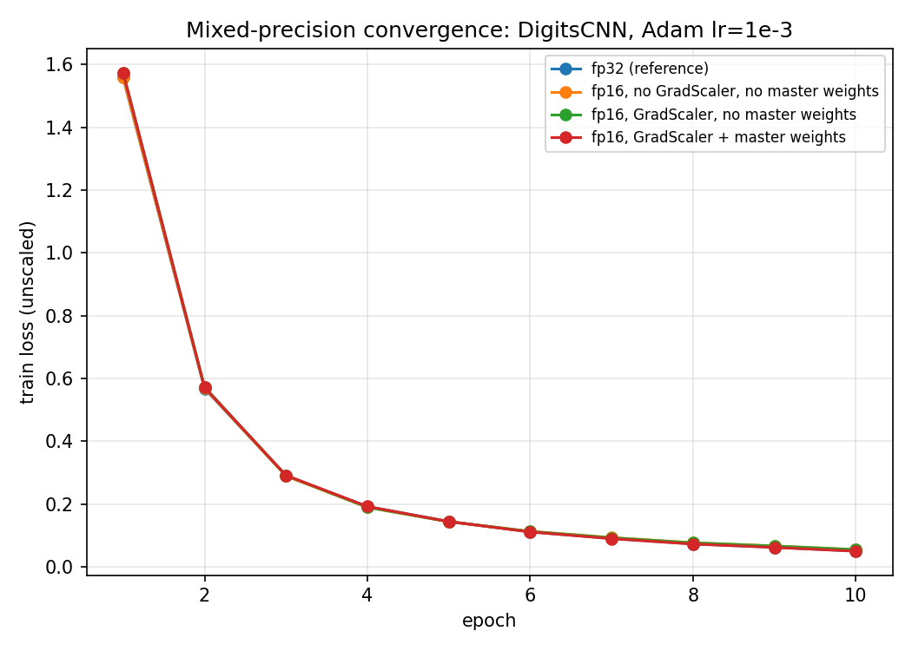

# Mixed-precision numerical-error and convergence study

## Numerical error: fp16 vs fp64

| Layer | output max rel err | output max abs err | grad max rel err | grad max abs err |
|---|---|---|---|---|
| Linear(64, 32) | 2.751e-02 | 8.547e-04 | 2.371e-02 | 5.117e-04 |
| Conv2d+BatchNorm2d+ReLU | 1.710e-02 | 2.933e-03 | 9.999e-02 | 3.128e-03 |
| LayerNorm(32) | 3.335e-02 | 2.180e-03 | 1.128e-01 | 2.289e-03 |
| MultiHeadAttention(32, 4h) + causal mask | 2.877e-02 | 5.073e-04 | 3.139e-01 | 8.733e-04 |

## Gradient underflow: zero-grad fraction, with/without GradScaler

| parameter | zero-grad fraction, no scaling | zero-grad fraction, with GradScaler |
|---|---|---|
| conv1.weight | 0.00% | 0.00% |
| conv1.bias | 0.00% | 0.00% |
| bn1.gamma | 0.00% | 0.00% |
| bn1.beta | 0.00% | 0.00% |
| conv2.weight | 0.00% | 0.00% |
| conv2.bias | 6.25% | 0.00% |
| bn2.gamma | 0.00% | 0.00% |
| bn2.beta | 0.00% | 0.00% |
| fc.weight | 3.52% | 0.00% |
| fc.bias | 0.00% | 0.00% |

## Synthetic update-underflow demo

A parameter starting at 1000.0 receiving 2000 identical tiny updates (~1e-3 each, ~2.0 in total):

- naive in-place fp16 update: `1000.0` (never moved -- each update alone is below fp16's ULP here)
- Adam + fp32 master-weight shadow: `998.0` (progress accumulated in fp32, surfaced once it crossed an ULP boundary)

## Convergence: DigitsCNN, fp32 vs fp16 configurations

| epoch | fp32 (reference) | fp16, no GradScaler, no master weights | fp16, GradScaler, no master weights | fp16, GradScaler + master weights |
|---|---|---|---|---|
| 1 | 1.5584 | 1.5586 | 1.5740 | 1.5745 |
| 2 | 0.5680 | 0.5700 | 0.5733 | 0.5714 |
| 3 | 0.2906 | 0.2896 | 0.2912 | 0.2919 |
| 4 | 0.1924 | 0.1899 | 0.1902 | 0.1926 |
| 5 | 0.1449 | 0.1441 | 0.1441 | 0.1445 |
| 6 | 0.1119 | 0.1134 | 0.1129 | 0.1114 |
| 7 | 0.0909 | 0.0936 | 0.0929 | 0.0900 |
| 8 | 0.0736 | 0.0772 | 0.0767 | 0.0729 |
| 9 | 0.0626 | 0.0669 | 0.0665 | 0.0622 |
| 10 | 0.0507 | 0.0554 | 0.0551 | 0.0502 |

